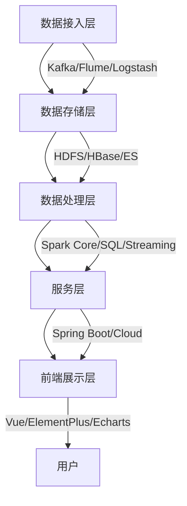

# 大数据系统

## 项目介绍

这是一个具备高可扩展性与高性能的大数据系统，整体架构分为数据接入层、数据存储层、数据处理层、服务层以及前端展示层。系统旨在解决海量数据的采集、存储、处理和可视化分析等问题，为企业提供全方位的大数据解决方案。

### 项目价值

- **高性能**：采用分布式架构，支持水平扩展，能够处理PB级数据
- **高可用**：关键组件均支持集群部署，消除单点故障
- **实时性**：支持数据实时采集、处理和分析，满足业务实时决策需求
- **易扩展**：模块化设计，便于功能扩展和定制化开发
- **安全可靠**：提供完善的数据安全保障机制

## 系统架构



系统采用分层架构设计，各层职责明确，相互协作：

### 数据接入层

- **功能**：负责从多样化的数据源收集数据，支持全量数据导入和增量数据实时同步
- **组件**：Kafka、Flume、Logstash、自定义数据采集器
- **特点**：支持批量导入、实时采集、数据清洗和转换

### 数据存储层

- **功能**：采用分布式文件系统HDFS、HBase和Elasticsearch存储不同类型的数据
- **组件**：
  - **HDFS**：存储原始数据和大文件
  - **HBase**：存储结构化和半结构化数据
  - **Elasticsearch**：存储需要全文检索的数据
  - **MySQL**：存储元数据和业务数据
  - **MongoDB**：存储文档型数据

### 数据处理层

- **功能**：基于Apache Spark构建数据处理引擎，支持批处理和流处理
- **组件**：
  - **Spark Core**：分布式数据处理
  - **Spark SQL**：结构化数据处理
  - **Spark Streaming**：实时数据处理
  - **Spark MLlib**：机器学习算法库

### 服务层

- **功能**：基于Spring Boot和Spring Cloud构建微服务架构
- **组件**：
  - **服务注册与发现**：Eureka/Nacos
  - **服务网关**：Spring Cloud Gateway
  - **负载均衡**：Ribbon
  - **服务熔断**：Hystrix/Sentinel
  - **配置中心**：Spring Cloud Config/Nacos

### 前端展示层

- **功能**：采用Vue.js构建用户界面，实时展示处理后的数据
- **组件**：
  - **Vue 3**：前端框架
  - **ElementPlus**：UI组件库
  - **Echarts**：数据可视化
  - **Axios**：HTTP客户端

## 技术栈

### 前端
- **框架**：Vue 3.3.4 + Vue Router 4.2.4 + Vuex 4.1.0
- **UI库**：ElementPlus 2.3.12组件库
- **可视化**：Echarts 5.4.3数据可视化
- **HTTP客户端**：Axios 1.5.0
- **构建工具**：Vite 4.4.9
- **CSS预处理器**：Sass 1.66.1
- **状态管理**：Vuex 4.1.0
- **响应式设计**：适配多种设备屏幕

### 后端
- **基础框架**：Java 8 + Spring Boot 2.7.0 + Spring Cloud 2021.0.3
- **API设计**：RESTful API
- **ORM框架**：MyBatis + MyBatis-Plus 3.5.2
- **数据库**：
  - **关系型**：MySQL 8.0.29
  - **NoSQL**：MongoDB 4.6.1
  - **列式存储**：HBase 2.4.11
  - **搜索引擎**：Elasticsearch 7.17.3
- **消息队列**：Kafka 3.1.0
- **大数据处理**：
  - **分布式计算**：Spark 3.2.1
  - **分布式存储**：Hadoop 3.3.2

## 功能模块

### 用户管理
- 用户注册、登录、权限管理
- 基于RBAC的权限控制
- 支持OAuth2.0第三方登录
- JWT令牌认证

### 数据管理
- 数据上传、下载、删除和修改
- 数据源管理和配置
- 数据质量监控
- 数据血缘追踪

### 数据分析
- 数据筛选、排序、分组和聚合
- 自定义分析模型
- 支持SQL查询和可视化查询构建器
- 分析结果导出（Excel、PDF等）

### 实时监控
- 系统运行状态和数据变化监控
- 自定义监控指标和告警规则
- 监控大屏展示
- 异常事件推送

### 数据安全
- 数据传输加密、敏感数据加密存储
- 数据访问控制和审计
- 数据脱敏和水印
- 数据备份和恢复

## 安装部署

### 环境要求

#### 基础环境
- JDK 1.8+（推荐使用Oracle JDK 1.8.0_291）
- Node.js 14+（推荐使用Node.js 14.18.0或更高版本）
- MySQL 8.0+（推荐使用MySQL 8.0.29）
- Maven 3.6+（推荐使用Maven 3.6.3或更高版本）
- Docker & Docker Compose（可选，用于容器化部署）

#### 大数据环境（可选，根据需求安装）
- Hadoop 3.3.2
- Spark 3.2.1
- HBase 2.4.11
- Elasticsearch 7.17.3
- MongoDB 4.6.1
- Kafka 3.1.0

### 后端部署

#### 数据库配置

1. 创建MySQL数据库

```bash
# 登录MySQL
mysql -u root -p

# 创建数据库
CREATE DATABASE bigdata_db DEFAULT CHARACTER SET utf8mb4 COLLATE utf8mb4_unicode_ci;

# 授权（根据实际情况调整用户名和密码）
GRANT ALL PRIVILEGES ON bigdata_db.* TO 'root'@'localhost' IDENTIFIED BY 'root';
FLUSH PRIVILEGES;
```

2. 导入初始数据（可选）

```bash
# 导入SQL脚本（如果有）
mysql -u root -p bigdata_db < /path/to/init.sql
```

#### 克隆与构建项目

```bash
# 克隆项目
git clone https://gitee.com/wengxiulin/bigdataai.git

# 进入后端目录
cd bigdataai/backend

# 编译打包
mvn clean package -DskipTests
```

#### 配置应用参数

在`src/main/resources/application.yml`或`application-dev.yml`中配置数据库连接：

```yaml
spring:
  datasource:
    url: jdbc:mysql://localhost:13306/bigdata_db?useSSL=false&serverTimezone=UTC
    username: root
    password: root
    driver-class-name: com.mysql.cj.jdbc.Driver
```

#### 启动应用

```bash
# 开发环境启动
java -jar target/bigdata-ai-backend-1.0.0.jar --spring.profiles.active=dev

# 生产环境启动（增加JVM参数）
java -Xms512m -Xmx1024m -jar target/bigdata-ai-backend-1.0.0.jar --spring.profiles.active=prod
```

### 前端部署

#### 安装Node.js和npm

1. 从[Node.js官网](https://nodejs.org/)下载并安装Node.js 14+
2. 验证安装

```bash
node -v  # 应显示v14.x.x或更高版本
npm -v   # 应显示6.x.x或更高版本
```

#### 配置npm镜像（可选，推荐国内用户配置）

```bash
# 设置淘宝镜像
npm config set registry https://registry.npmmirror.com
```

#### 安装与启动项目

```bash
# 进入前端目录
cd bigdataai/frontend

# 安装依赖
npm install

# 开发模式运行（热重载）
npm run dev
```

#### 前端开发注意事项

1. 开发服务器默认运行在 http://localhost:5173
2. 修改API接口地址：在`src/api/config.js`或相关配置文件中设置后端API地址

```javascript
// 示例配置
const API_BASE_URL = process.env.NODE_ENV === 'production' 
  ? 'http://production-api.example.com' 
  : 'http://localhost:8080';

export default API_BASE_URL;
```

#### 生产环境构建与部署

```bash
# 构建生产环境版本
npm run build

# 预览生产构建
npm run preview

# 部署到Web服务器
# 将dist目录下的文件复制到Web服务器的静态资源目录
```

### Docker部署（可选）

#### 安装Docker和Docker Compose

1. 安装Docker：按照[Docker官方文档](https://docs.docker.com/get-docker/)安装
2. 安装Docker Compose：按照[Docker Compose官方文档](https://docs.docker.com/compose/install/)安装

#### 使用Docker Compose部署

1. 在项目根目录创建或修改`docker-compose.yml`文件（如果不存在）

```yaml
version: '3'

services:
  mysql:
    image: mysql:8.0
    container_name: bigdata-mysql
    restart: always
    environment:
      MYSQL_ROOT_PASSWORD: root
      MYSQL_DATABASE: bigdata_db
    ports:
      - "13306:3306"
    volumes:
      - mysql-data:/var/lib/mysql

  backend:
    build: ./backend
    container_name: bigdata-backend
    restart: always
    depends_on:
      - mysql
    ports:
      - "8080:8080"
    environment:
      SPRING_DATASOURCE_URL: jdbc:mysql://mysql:3306/bigdata_db?useSSL=false&serverTimezone=UTC
      SPRING_DATASOURCE_USERNAME: root
      SPRING_DATASOURCE_PASSWORD: root

  frontend:
    build: ./frontend
    container_name: bigdata-frontend
    restart: always
    ports:
      - "80:80"
    depends_on:
      - backend

volumes:
  mysql-data:
```

2. 启动服务

```bash
# 在项目根目录执行
docker-compose up -d

# 查看容器状态
docker-compose ps

# 查看日志
docker-compose logs -f
```

3. 停止服务

```bash
# 停止并移除容器
docker-compose down

# 停止并移除容器及卷（会删除数据）
docker-compose down -v
```

## 项目截图

### 登录界面


### 数据分析


### 监控大屏


## 贡献指南

1. Fork 本仓库
2. 创建您的特性分支 (`git checkout -b feature/AmazingFeature`)
3. 提交您的更改 (`git commit -m 'Add some AmazingFeature'`)
4. 推送到分支 (`git push origin feature/AmazingFeature`)
5. 打开一个 Pull Request

## 许可证

本项目采用 MIT 许可证 - 详见 [LICENSE](LICENSE) 文件

## 联系方式

- 项目维护者：您的名字
- 邮箱：your.email@example.com
- 项目链接：[https://github.com/yourusername/bigdataai](https://github.com/yourusername/bigdataai)